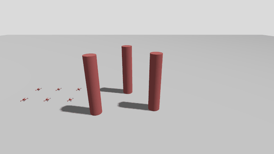
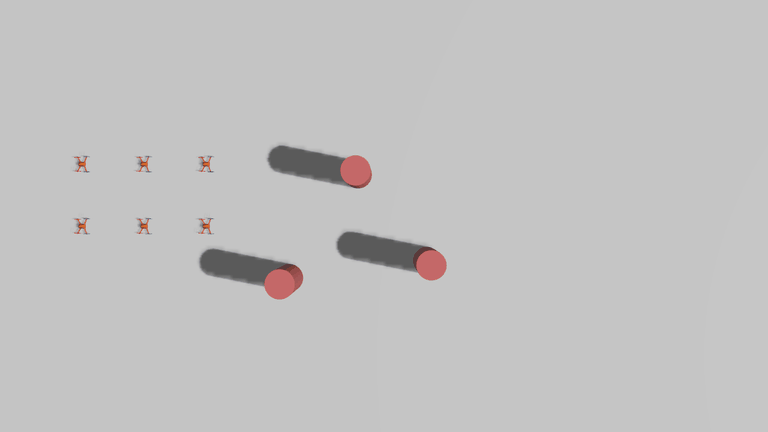

# Flockwork

An open-source decentralized drone swarm control system, built from the ground up in C++ on ROS 2 + Gazebo. This project implements the full control stack - a single-agent control through a multi-agent consensus, instead of leaning on a pre-built autopilot (PX4/ArduPilot), so that keeps the control theory visible which is my intent.



*six drones take off, split around the pillars, and re-form their grid at the destination.*



*Top-down view of the same run.*

## References

The control laws here are written from scratch, but the ideas behind them come from:

- **Flocking (consensus controller):** R. Olfati-Saber, "Flocking for Multi-Agent Dynamic Systems: Algorithms and Theory," *IEEE Transactions on Automatic Control*, 51(3):401-420, 2006. [Caltech technical report](https://authors.library.caltech.edu/28030)
- **Formation slots (displacement-based formation control):** K.-K. Oh, M.-C. Park, H.-S. Ahn, "A survey of multi-agent formation control," *Automatica*, 53:424-440, 2015. [Record](https://scholar.gist.ac.kr/handle/local/14790)
- **Obstacle and neighbor braking (control barrier functions):** A. D. Ames, S. Coogan, M. Egerstedt, G. Notomista, K. Sreenath, P. Tabuada, "Control Barrier Functions: Theory and Applications," *European Control Conference*, 2019. [arXiv:1903.11199](https://arxiv.org/abs/1903.11199)
- **Mean-field density control (Lloyd's algorithm):** J. Cortés, S. Martínez, T. Karatas, F. Bullo, "Coverage Control for Mobile Sensing Networks," *IEEE Transactions on Robotics and Automation*, 20(2):243-255, 2004. [arXiv:math/0212212](https://arxiv.org/abs/math/0212212)
- **Simulated vehicle (Gazebo's multicopter velocity controller):** T. Lee, M. Leok, N. H. McClamroch, "Control of Complex Maneuvers for a Quadrotor UAV using Geometric Methods on SE(3)," 2010. [arXiv:1003.2005](https://arxiv.org/abs/1003.2005)


# AI

No AI was used in this project throughout, so please do not open an issue or PR if the code is not checked or reviewed, contributors are welcome to use LLMs to generate code, but please review and test any generated code before opening an issue or PR. Unreviewed AI output will be closed.
## Status

Stages 1 to 5 are working in simulation. A six-drone swarm flies point A to point B through static obstacles and wind, it holds a grid formation, and settles mostly without collisions. Next up is lidar-only obstacle sensing and real hardware implementation. See [Roadmap](#roadmap).

## Stack

- **ROS 2 Jazzy** (Ubuntu 24.04 / WSL2): inter-agent messaging. Pub/sub over DDS maps naturally onto decentralized neighbor communication.
- **Gazebo Harmonic** (`ros_gz` bridge): rigid-body physics simulation
- **C++17**: controllers, dynamics, consensus logic

## Repo layout

```
src/
  swarm_control/          # main ROS 2 package, the control theory (CT)
    include/swarm_control/ # headers (PID, dynamics, consensus)
    src/                   # node implementations
    launch/                # ROS 2 launch files
    worlds/                # Gazebo world files
    models/                # Gazebo SDF drone models
tests/                    # stress-test scenarios, kept separate from CT
  launch/stress_test.launch.py
  worlds/stress_test.sdf
```

# Obstacle Detection Logic

Two sources feed `ObstacleAvoidance`, both just produce the same `Obstacle{position, radius}` list. The default is a fixed list of known positions or radii passed as launch params. Opt-in with `use_lidar_sensing:=true` (stress test only) adds a simulated 2D lidar per drone: `LidarObstacleDetector` clusters the scan into world-frame obstacle estimates. A real-hardware mounting-offset lookup is sketched but commented out in `consensus_controller_node.cpp`, since the sim assumes the lidar sits at the drone's own origin.(This is work in progress)

## Stress testing

`tests/stress_test.launch.py` (not part of the `swarm_control` package on purpose) runs stages 3 and 4 against wind, three static pillars, tight formation spacing, and a real point A to point B transit instead of hovering or orbiting in place. This is the scenario in the GIF above.

```bash
ros2 launch tests/launch/stress_test.launch.py
```

Useful flags that can be used: `num_drones:=9` for a harder squeeze, `use_formation:=false` to compare against plain flocking, `use_path:=true path:='-8,0;0,3;8,0'` to fly waypoints, `use_lidar_sensing:=true` to detect obstacles with simulated lidar on top of the known positions.

Drone-to-drone spacing has a safety floor: `min_safe_distance` defaults to 0.9m, above the X3 model's real ~0.71m rotor-to-rotor collision floor. Going below that is a physical collision no control law can prevent. If you see runaway altitude or wild positions during testing, check for stale `ros2 launch` / `parameter_bridge` processes left over from a previous run first (`ps aux | grep gz`). Two simulations publishing to the same topic names looks exactly like instability but is not.

Known limitation - the navigation term is proportional only, so a steady wind leaves the final formation offset by a few tenths of a meter.

## Roadmap

1. **Single quadrotor control**: rigid-body model in Gazebo, C++ PID node holding a position setpoint. Done, see `single_drone.launch.py`.
2. **N independent drones**: same controller, replicated, no coordination yet(for now). Done, see `swarm.launch.py`.
3. **Decentralized consensus**: drones exchange local state over ROS 2 topics with neighbors and converge on a shared formation/heading. The core "swarm" behavior. Done, see `consensus_controller_node.cpp`, three local forces (separation/cohesion, velocity alignment, acceleration feedforward from a filtered neighbor-state estimate) plus a navigation term toward a shared goal. Verified stable(Note this is in Gazebo) (velocities settle to approx 0, so no divergence or collisions) both standalone and combined with stage 5. Gains tuned, all overridable via launch args, see `desired_spacing`, `interaction_range`, and the `*_gain` arguments on `swarm.launch.py`.
   - **Formation slots** (`use_formation`, on in the stress test): each drone holds a grid slot relative to its neighbors (displacement-based formation control), with a dead zone (`formation_deadband`) where it neither pushes nor pulls. This replaced the old tether, which pulled every drone toward every neighbor and caused oscillation.
   - **Settle mode**: when fewer than 2 drones are actively moving, the repel and contract forces drop to 0.3x so small corrections don't chain-react through the swarm.
   - **Body-frame commands**: Gazebo's velocity controller takes body-frame velocity, so commands are rotated by the drone's yaw and yaw is held at zero. Without this, a yaw bump from a collision rotates every command and the drone spirals away.
4. **Collision avoidance**: layered on top of consensus, see `obstacle_avoidance.hpp`.
   - **Sideways dodge**: forward velocity is kept, and a sideways velocity just large enough to clear the obstacle by the time the drone reaches it is added. The side is picked by geometry, or by whichever side has fewer neighbors when the obstacle is dead ahead.
   - **Braking filter** (a simple control barrier function): the part of a command heading into a pillar or a neighbor is capped at the speed the drone can still stop from, and the removed speed is redirected into sliding around the obstacle instead of stalling.
   - **Takeoff hold**: no horizontal motion until the drone reaches 80% of its hover height.
5. **Mean-field density control**: a global layer, separate from stage 3's local consensus, that treats the swarm as a collective. Computes a voronoi partition of a target density function from current drone positions (Lloyd's algorithm / Cortes et al. coverage control) and publishes each drone's cell centroid as its target. Individual PID control is unchanged, this only changes what target it chases. Done as well, see `mean_field_controller_node.cpp`. A fully decentralized version (each drone computes its own cell from neighbors only, no central node) is sketched but disabled in `distributed_density_controller_node.cpp`.

## Building

This is a standard [colcon](https://colcon.readthedocs.io/) workspace. From WSL2 (Ubuntu 24.04) with ROS 2 Jazzy sourced:

```bash
source /opt/ros/jazzy/setup.bash
colcon build --symlink-install
source install/setup.bash
```

## Running

Single drone (stage 1):

```bash
ros2 launch swarm_control single_drone.launch.py
```

N independent drones (stage 2), grid-spaced so none cross paths, with the mean-field density controller (stage 5) reshaping them toward two target blobs by default:

```bash
ros2 launch swarm_control swarm.launch.py num_drones:=5
```

Add `headless:=true` to run Gazebo server-only, no GUI window (which is useful with no display attached). Add `use_mean_field:=false` to disable the density controller and just get stage 2's independent hovering. Add `use_consensus:=true` to swap in stage 3's flocking control (each drone reacts to its neighbors, not just a fixed setpoint):

```bash
ros2 launch swarm_control swarm.launch.py num_drones:=5 use_consensus:=true
```

Add `orbit_speed:=0.3` (rad/s) to make the mean-field target blobs orbit the center instead of sitting still, so the swarm keeps flying in a moving formation instead of converging once and stopping.

## Development environment

Developed on Windows via [VS Code Remote - WSL](https://code.visualstudio.com/docs/remote/wsl). The toolchain (ROS 2, Gazebo, compilers) lives in WSL2 Ubuntu 24.04; this repo is accessed at its Windows path (`/mnt/c/...`) from inside WSL. Open this folder in VS Code, then use "Remote-WSL: Reopen Folder in WSL" (Ctrl+Shift+P) to get IntelliSense and terminal access wired to the WSL toolchain.

## License

MIT-based, with a non-military field-of-use restriction. See [LICENSE](LICENSE). Because it restricts who can use the software, this is a **source-available** license, not an OSI-approved "open source" license, even though the code is public and modifiable.
